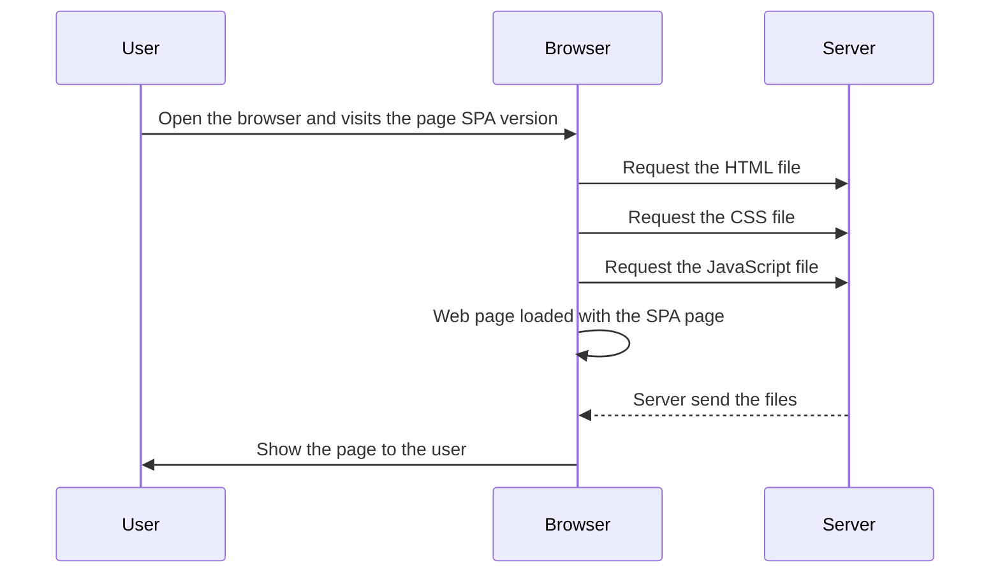

# Exercise 0.5: Single page application diagram.

```mermaid
sequenceDiagram
    participant User
    participant Browser
    participant Server

    User->>Browser: Open the browser and visits the page SPA version
    Browser->>Server: Request the HTML file
    Browser->>Server: Request the CSS file
    Browser->>Server: Request the JavaScript file
    Browser->>Browser: Web page loaded with the SPA page 
    Server-->>Browser: Server send the files
    Browser->>User: Show the page to the user
```