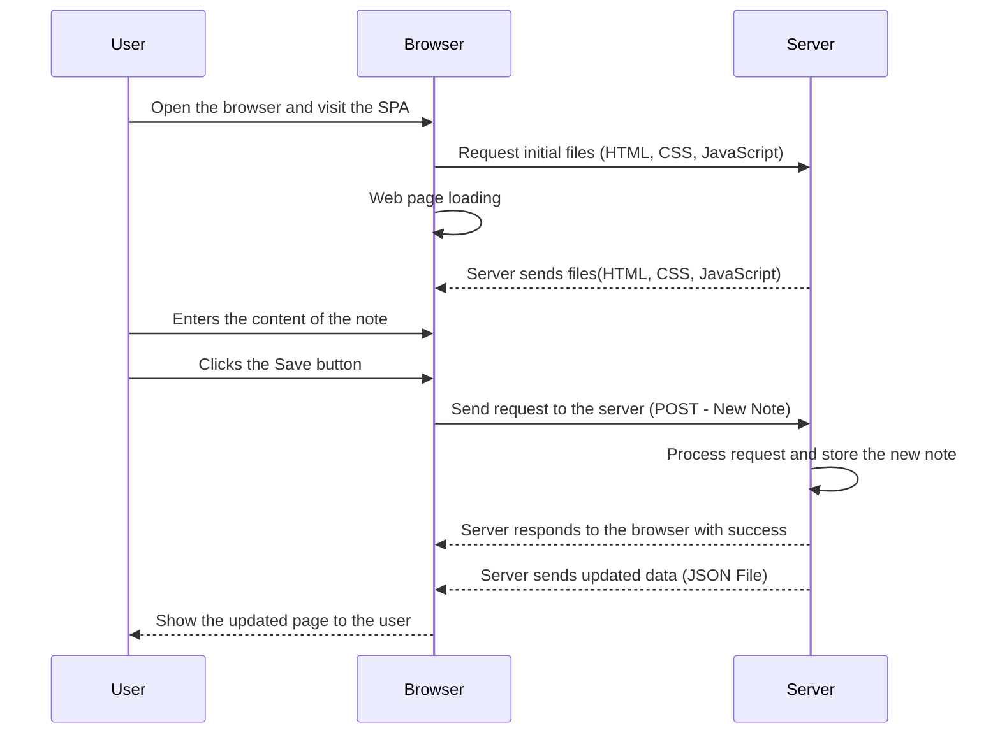

# Exercise 0.6: New note diagram in SPA page.

```mermaid
sequenceDiagram
    participant User
    participant Browser
    participant Server

    User->>Browser: Open the browser and visit the SPA
    Browser->>Server: Request initial files (HTML, CSS, JavaScript)
    Browser->>Browser: Web page loading
    Server-->>Browser: Server sends files(HTML, CSS, JavaScript)
    User->>Browser: Enters the content of the note
    User->>Browser: Clicks the Save button
    Browser->>Server: Send request to the server (POST - New Note)
    Server->>Server: Process request and store the new note
    Server-->>Browser: Server responds to the browser with success
    Server-->>Browser: Server sends updated data (JSON File)
    Browser-->>User: Show the updated page to the user
```